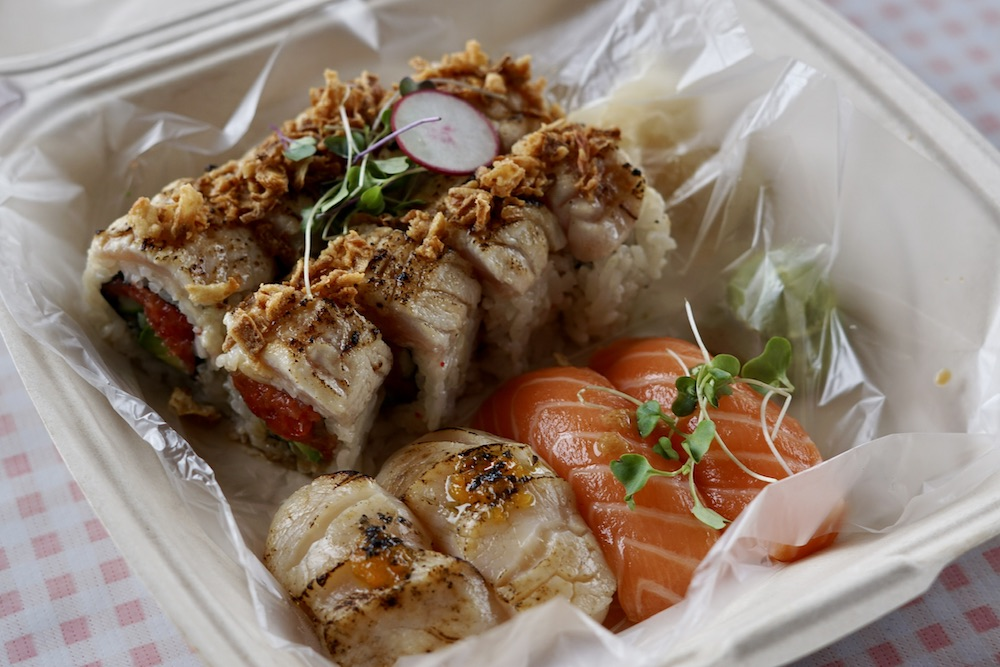

Portland has one of the fastest growing Asian communities in the entire United States! I haven't been there in 2 years so I knew I wanted to try out some new places and I was **not** disapointed. 

### Food Truck Sushi
I have been meaning to try out Yoshi's Sushi since I saw a Munchies video on the food truck back in 2021. It can be really difficult to obtain said sushi though, as he is only open from Tuesday-Saturday for short lunch and dinner hours. You also have to call ahead to order as he makes all the orders fresh right in time for pick up! That's why within 5 minutes of picking up my car, I immediately called so I could pick up right at noon!

Yoshi serves his sushi out of an inconspicuous yellow food truck located right in the French Quarter in Southwest Portland. I ordered Salmon Nigiri, Scallop Nigiri and a Spicy Tuna roll that was topped with crispy onions and seared Scallop. Yoshi had my sushi ready right at noon for pick up and I sat down right in the French Quarter to enjoy my meal. I couldn't believe how fresh the sushi looked, and it tasted just as fresh as it looked!

Even after spending most of the summer in Japan, I have to say this sushi was just as good as most of the places I ate at within the same price point. I can definitely see why the truck is hyped and I would highly recommend being able to say that you had amazing food truck sushi.

### Gimbap Party!
I love grabbing Gimbap at the store on the way home, so reading that it was offered as the star of a tasting menu caught my attention. Luckily my friends were willing to try it out with me so I didn't have to sit at a table by myself while I tried to figure out what a Gimbap Party was. 

When we arrived at the restaurant I got an Umami Mammie, which was basically a Gimlet with the umami pumped up to 11. The added sesame and miso added a ton of salty aftertaste to the drink and I actually really loved it. They started us off with some banchan and suyuk and the broth was so rich we were all grabbing as much as we could with our spoons. The party portion of the meal was essentially a deconstructed Gimbap! The sizzling bulgolgi and pork belly were amazing, but the real star of the protein show was the Hokkaido scallop which paired perfectly with the tangy mayo sauce they served it with. 

I didn't think that I would be able to justify spending so much on a Gimbap meal, but I honestly can say it was worth it. The vibe of the meal was relaxed but fun while the staff were on top of it. The only dissapointing part was that they were not able to finish the night off with Karaoke, where they normally get some bops going with the crew and possible participants at their tables. I was definitely hoping to ruin some meals while poorly singing Olivia. 

### Toki
We made a stop at Toki, which has become the location where Han Oak has moved their more casual and ala carte items. 

### Coffee
Since I was last in Portland I've grown to love coffee and even though my tastes aren't exteremely refined or anything, I love checking out third wave coffee shops whenever I go to a new city now. Luckily Portland has a crazy diverse coffee scene so I was able to get my fair share. I was able to grab Coava Coffee, Deadstock Coffee roasters and PUSH X PULL and I loved the single origin blends I tried. 

### Nimblefish
I started my trip with sushi from a food truck, so I thought it was only fitting that I ended with an omakase that cost triple that amount. We got a reservation for 3 for our last meal before our flight back and it was probably one of the best sushi meals I've had in a while (this is including 2 months in Japan)!! We got a 